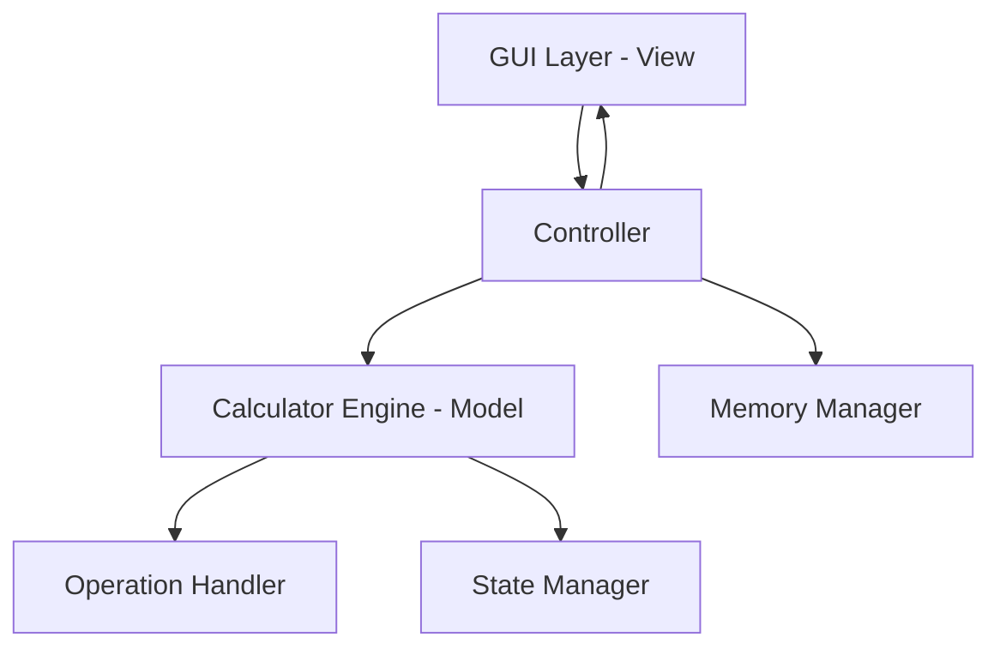
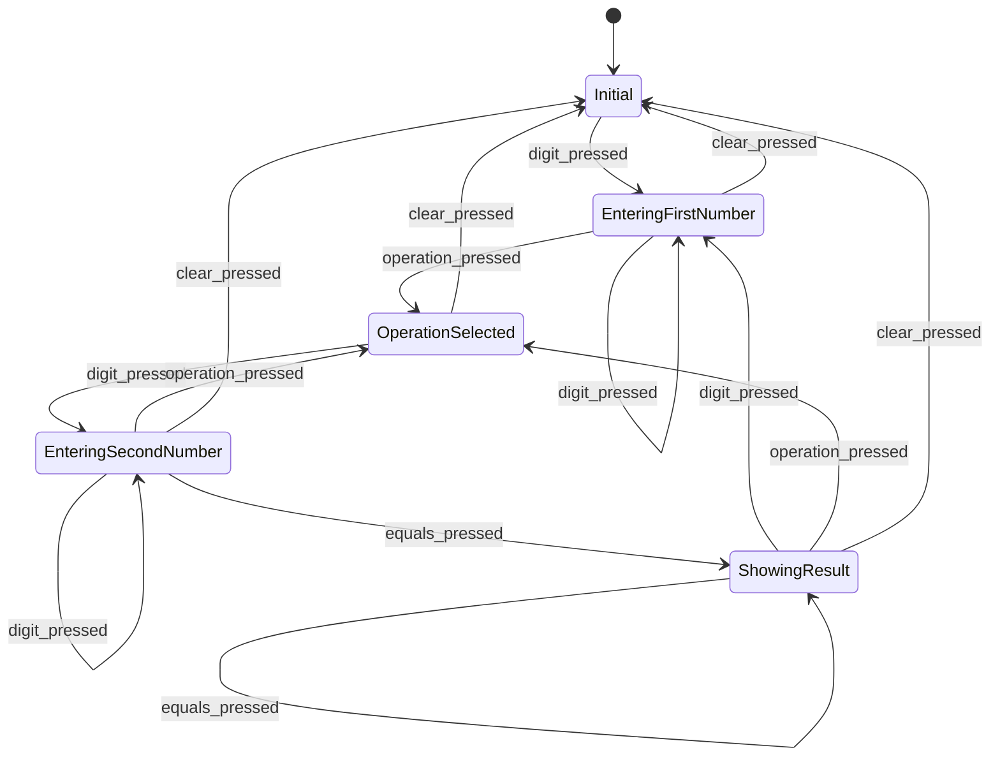

# Design Document: Personal Calculator

## Overview

Личный калькулятор - это десктопное приложение с графическим интерфейсом, реализующее функциональность стандартного калькулятора Windows. Приложение предоставляет базовые арифметические операции, функции памяти, процентные вычисления и дополнительные математические функции.

### Key Design Decisions

- **Архитектура**: Model-View-Controller (MVC) для разделения логики вычислений от UI
- **Технологический стек**: Python с библиотекой tkinter для GUI (кроссплатформенность и простота)
- **Состояние**: Конечный автомат для управления состояниями калькулятора (ввод первого числа, ожидание операции, ввод второго числа, отображение результата)
- **Точность**: Использование типа Decimal для избежания ошибок округления с плавающей точкой

## User Interface Design

### Visual Layout

Калькулятор имеет компактный интерфейс в стиле Windows Calculator с четкой организацией элементов:

```
┌─────────────────────────────────────┐
│  Personal Calculator            [_][□][X]│
├─────────────────────────────────────┤
│                                     │
│  ┌───────────────────────────────┐ │
│  │                             0 │ │  ← Display (выравнивание вправо)
│  └───────────────────────────────┘ │
│                                     │
│  ┌────┬────┬────┬────┬────┬────┐  │
│  │ MC │ MR │ MS │ M+ │ M- │    │  │  ← Кнопки памяти
│  └────┴────┴────┴────┴────┴────┘  │
│                                     │
│  ┌────┬────┬────┬────┬────┬────┐  │
│  │ ← │ CE │ C  │ ±  │ √  │ ÷  │  │  ← Управление и операции
│  ├────┼────┼────┼────┼────┼────┤  │
│  │ 7  │ 8  │ 9  │ x² │ 1/x│ ×  │  │
│  ├────┼────┼────┼────┼────┼────┤  │
│  │ 4  │ 5  │ 6  │    │    │ -  │  │  ← Цифровая клавиатура
│  ├────┼────┼────┼────┼────┼────┤  │     и операции
│  │ 1  │ 2  │ 3  │    │    │ +  │  │
│  ├────┼────┼────┼────┼────┼────┤  │
│  │ 0       │ .  │ %  │    │ =  │  │
│  └────────┴────┴────┴────┴────┘  │
│                                     │
└─────────────────────────────────────┘
```

### UI Components Specification

**Display Area**:
- Размер: 320x60 пикселей
- Фон: белый (#FFFFFF)
- Текст: черный (#000000), шрифт Segoe UI, 24pt
- Выравнивание: по правому краю
- Отступы: 10px со всех сторон
- Граница: 1px solid #CCCCCC

**Buttons Layout**:

1. **Memory Buttons Row** (MC, MR, MS, M+, M-):
   - Размер каждой кнопки: 50x40 пикселей
   - Цвет фона: светло-серый (#E0E0E0)
   - Цвет текста: черный (#000000)
   - Шрифт: Segoe UI, 11pt

2. **Control & Operations Row** (Backspace, CE, C, ±, √, ÷):
   - Размер: 50x50 пикселей
   - Backspace (←): светло-красный (#FFE0E0)
   - CE, C: светло-красный (#FFE0E0)
   - ±, √: светло-синий (#E0E8FF)
   - ÷: оранжевый (#FFA500)

3. **Digit Buttons** (0-9):
   - Размер: 50x50 пикселей
   - Цвет фона: белый (#FFFFFF)
   - Цвет текста: черный (#000000)
   - Шрифт: Segoe UI, 14pt, полужирный
   - Граница: 1px solid #CCCCCC
   - Кнопка "0": двойная ширина (100x50 пикселей)

4. **Operation Buttons** (+, -, ×, ÷):
   - Размер: 50x50 пикселей
   - Цвет фона: оранжевый (#FFA500)
   - Цвет текста: белый (#FFFFFF)
   - Шрифт: Segoe UI, 18pt, полужирный

5. **Special Function Buttons** (x², 1/x, %, .):
   - Размер: 50x50 пикселей
   - Цвет фона: светло-синий (#E0E8FF)
   - Цвет текста: черный (#000000)
   - Шрифт: Segoe UI, 12pt

6. **Equals Button** (=):
   - Размер: 50x50 пикселей
   - Цвет фона: темно-оранжевый (#FF8C00)
   - Цвет текста: белый (#FFFFFF)
   - Шрифт: Segoe UI, 18pt, полужирный

### Button Grid Layout

```
Row 0 (Memory):    [MC] [MR] [MS] [M+] [M-] [  ]
Row 1 (Control):   [←]  [CE] [C]  [±]  [√]  [÷]
Row 2:             [7]  [8]  [9]  [x²] [1/x][×]
Row 3:             [4]  [5]  [6]  [  ] [  ] [-]
Row 4:             [1]  [2]  [3]  [  ] [  ] [+]
Row 5:             [0      ]  [.]  [%] [  ] [=]
```

### Color Scheme

**Primary Colors**:
- Background: светло-серый (#F0F0F0)
- Display: белый (#FFFFFF)
- Digit buttons: белый (#FFFFFF)
- Operation buttons: оранжевый (#FFA500)
- Special functions: светло-синий (#E0E8FF)
- Clear buttons: светло-красный (#FFE0E0)
- Memory buttons: светло-серый (#E0E0E0)

**Text Colors**:
- Display text: черный (#000000)
- Button text: черный (#000000) или белый (#FFFFFF) в зависимости от фона
- Error text: красный (#FF0000)

### Window Properties

- **Размер окна**: 360x480 пикселей
- **Минимальный размер**: 360x480 пикселей (не изменяется)
- **Заголовок**: "Personal Calculator"
- **Иконка**: стандартная иконка калькулятора
- **Resizable**: нет (фиксированный размер)

### Interaction States

**Button Hover**:
- Легкое затемнение цвета фона (на 10%)
- Курсор меняется на pointer

**Button Press**:
- Затемнение цвета фона (на 20%)
- Легкий эффект "вдавливания" (border inset)

**Button Disabled**:
- Прозрачность 50%
- Курсор: not-allowed

**Memory Indicator**:
- Когда в памяти есть значение, показывать маленький индикатор "M" в левом верхнем углу дисплея

### Keyboard Support

Калькулятор должен поддерживать ввод с клавиатуры:

- **Цифры 0-9**: ввод цифр
- **+, -, *, /**: операции
- **Enter или =**: вычислить результат
- **Backspace**: удалить последнюю цифру
- **Delete или Esc**: очистить (C)
- **. или ,**: десятичная точка
- **%**: процент

## Architecture

### High-Level Architecture



### Component Responsibilities

1. **GUI Layer (View)**
   - Отрисовка интерфейса калькулятора
   - Обработка пользовательских событий (клики кнопок)
   - Обновление дисплея

2. **Controller**
   - Координация между View и Model
   - Маршрутизация команд пользователя к соответствующим обработчикам
   - Форматирование данных для отображения

3. **Calculator Engine (Model)**
   - Выполнение арифметических операций
   - Управление состоянием вычислений
   - Валидация операций

4. **Memory Manager**
   - Хранение значения в памяти
   - Операции с памятью (store, recall, clear, add, subtract)

5. **Operation Handler**
   - Реализация всех математических операций
   - Обработка специальных случаев (деление на ноль, корень из отрицательного числа)

6. **State Manager**
   - Управление состояниями калькулятора
   - Переходы между состояниями

### State Machine



## Components and Interfaces

### 1. CalculatorEngine

**Responsibilities**: Основная логика вычислений

**Interface**:
```python
class CalculatorEngine:
    def input_digit(self, digit: str) -> None
    def input_decimal_point(self) -> None
    def select_operation(self, operation: Operation) -> None
    def calculate_result(self) -> Decimal
    def clear_entry(self) -> None
    def clear_all(self) -> None
    def backspace(self) -> None
    def toggle_sign(self) -> None
    def get_display_value(self) -> str
    def apply_percent(self) -> None
    def apply_square_root(self) -> None
    def apply_square(self) -> None
    def apply_reciprocal(self) -> None
```

### 2. MemoryManager

**Responsibilities**: Управление памятью калькулятора

**Interface**:
```python
class MemoryManager:
    def store(self, value: Decimal) -> None
    def recall(self) -> Decimal
    def clear(self) -> None
    def add(self, value: Decimal) -> None
    def subtract(self, value: Decimal) -> None
    def has_value(self) -> bool
```

### 3. OperationHandler

**Responsibilities**: Выполнение математических операций

**Interface**:
```python
class OperationHandler:
    @staticmethod
    def add(a: Decimal, b: Decimal) -> Decimal
    
    @staticmethod
    def subtract(a: Decimal, b: Decimal) -> Decimal
    
    @staticmethod
    def multiply(a: Decimal, b: Decimal) -> Decimal
    
    @staticmethod
    def divide(a: Decimal, b: Decimal) -> Decimal
    
    @staticmethod
    def square_root(a: Decimal) -> Decimal
    
    @staticmethod
    def square(a: Decimal) -> Decimal
    
    @staticmethod
    def reciprocal(a: Decimal) -> Decimal
    
    @staticmethod
    def percent(base: Decimal, percent_value: Decimal, operation: Operation) -> Decimal
```

### 4. CalculatorGUI

**Responsibilities**: Графический интерфейс пользователя

**Interface**:
```python
class CalculatorGUI:
    def __init__(self, controller: CalculatorController)
    def create_display(self) -> None
    def create_buttons(self) -> None
    def update_display(self, value: str) -> None
    def show_error(self, message: str) -> None
    def update_memory_indicator(self, has_memory: bool) -> None
```

### 5. CalculatorController

**Responsibilities**: Координация между GUI и Engine

**Interface**:
```python
class CalculatorController:
    def __init__(self, engine: CalculatorEngine, memory: MemoryManager)
    def handle_digit(self, digit: str) -> None
    def handle_operation(self, operation: Operation) -> None
    def handle_equals(self) -> None
    def handle_clear(self) -> None
    def handle_clear_entry(self) -> None
    def handle_backspace(self) -> None
    def handle_memory_store(self) -> None
    def handle_memory_recall(self) -> None
    def handle_memory_clear(self) -> None
    def handle_memory_add(self) -> None
    def handle_memory_subtract(self) -> None
    def handle_percent(self) -> None
    def handle_square_root(self) -> None
    def handle_square(self) -> None
    def handle_reciprocal(self) -> None
    def handle_sign_toggle(self) -> None
```

## Data Models

### Operation Enum

```python
from enum import Enum

class Operation(Enum):
    ADD = "+"
    SUBTRACT = "-"
    MULTIPLY = "*"
    DIVIDE = "/"
    NONE = None
```

### CalculatorState

```python
from dataclasses import dataclass
from decimal import Decimal
from typing import Optional

@dataclass
class CalculatorState:
    current_input: str = "0"
    first_operand: Optional[Decimal] = None
    second_operand: Optional[Decimal] = None
    operation: Operation = Operation.NONE
    last_operation: Operation = Operation.NONE
    last_operand: Optional[Decimal] = None
    is_new_input: bool = True
    has_decimal_point: bool = False
    display_value: str = "0"
    error_message: Optional[str] = None
```

### MemoryState

```python
from dataclasses import dataclass
from decimal import Decimal
from typing import Optional

@dataclass
class MemoryState:
    stored_value: Optional[Decimal] = None
    
    def has_value(self) -> bool:
        return self.stored_value is not None
```

### DisplayFormatter

```python
class DisplayFormatter:
    MAX_DIGITS = 15
    
    @staticmethod
    def format_number(value: Decimal) -> str:
        """
        Форматирует число для отображения:
        - До 15 значащих цифр
        - Научная нотация для очень больших/малых чисел
        - Удаление незначащих нулей
        """
        pass
```


## Correctness Properties

*A property is a characteristic or behavior that should hold true across all valid executions of a system-essentially, a formal statement about what the system should do. Properties serve as the bridge between human-readable specifications and machine-verifiable correctness guarantees.*

### Property 1: Addition correctness

*For any* two decimal numbers a and b, when the user performs addition operation, the calculator should display the result equal to the mathematical sum a + b.

**Validates: Requirements 1.1**

### Property 2: Subtraction correctness

*For any* two decimal numbers a and b, when the user performs subtraction operation, the calculator should display the result equal to the mathematical difference a - b.

**Validates: Requirements 1.2**

### Property 3: Multiplication correctness

*For any* two decimal numbers a and b, when the user performs multiplication operation, the calculator should display the result equal to the mathematical product a * b.

**Validates: Requirements 1.3**

### Property 4: Division correctness

*For any* two decimal numbers a and b where b ≠ 0, when the user performs division operation, the calculator should display the result equal to the mathematical quotient a / b.

**Validates: Requirements 1.4**

### Property 5: Digit input accumulation

*For any* sequence of digit inputs, the display should show the number formed by concatenating those digits in order.

**Validates: Requirements 2.1**

### Property 6: Decimal point addition

*For any* number being entered, when the decimal point button is pressed, the display should contain exactly one decimal point.

**Validates: Requirements 2.2**

### Property 7: Sign toggle is involutive

*For any* number, toggling the sign twice should return the original number (sign toggle is its own inverse).

**Validates: Requirements 2.4**

### Property 8: Clear entry preserves operation state

*For any* calculator state with a pending operation, pressing CE should clear only the current input while preserving the first operand and selected operation.

**Validates: Requirements 3.1**

### Property 9: Clear resets to initial state

*For any* calculator state, pressing C should reset the calculator to its initial state (display shows "0", no pending operations, no stored operands).

**Validates: Requirements 3.2**

### Property 10: Backspace removes last digit

*For any* number with n digits, pressing backspace should result in a number with n-1 digits (or "0" if n=1).

**Validates: Requirements 3.3**

### Property 11: Memory store and recall round trip

*For any* decimal number, storing it in memory (MS) and then recalling it (MR) should return the same value.

**Validates: Requirements 4.1, 4.2**

### Property 12: Memory clear empties memory

*For any* memory state, pressing MC should result in empty memory (MR returns 0 or indicates no value).

**Validates: Requirements 4.3**

### Property 13: Memory add accumulates correctly

*For any* initial memory value m and display value d, pressing M+ should result in memory containing m + d.

**Validates: Requirements 4.4**

### Property 14: Memory subtract accumulates correctly

*For any* initial memory value m and display value d, pressing M- should result in memory containing m - d.

**Validates: Requirements 4.5**

### Property 15: Display precision limit

*For any* number, the display should show at most 15 significant digits.

**Validates: Requirements 5.2**

### Property 16: Sequential operations chain correctly

*For any* sequence of operations (number, op1, number, op2), the calculator should compute the result of the first operation before applying the second operation.

**Validates: Requirements 6.1**

### Property 17: Repeated equals repeats last operation

*For any* completed calculation with operation op and operand b, pressing equals multiple times should repeatedly apply op with operand b to the result.

**Validates: Requirements 6.2**

### Property 18: Percent calculation with operation

*For any* two numbers a and b with operation op, pressing percent should calculate the percentage of a based on b according to the operation context.

**Validates: Requirements 8.1**

### Property 19: Square and square root are inverses

*For any* non-negative number x, applying square root to x² should return x (within precision limits).

**Validates: Requirements 9.1, 9.2**

### Property 20: Reciprocal is involutive

*For any* non-zero number x, applying reciprocal twice (1/(1/x)) should return x (within precision limits).

**Validates: Requirements 9.3**

## Error Handling

### Error Categories

1. **Mathematical Errors**
   - Division by zero
   - Square root of negative number
   - Reciprocal of zero

2. **Input Validation Errors**
   - Number too large for display
   - Invalid number format

3. **State Errors**
   - Operation without operand
   - Memory recall when empty

### Error Handling Strategy

**Display Error Messages**:
- Errors should be displayed on the calculator display
- Error messages should be clear and concise
- Standard messages: "Cannot divide by zero", "Invalid input", "Error"

**Error Recovery**:
- Any button press after error should clear the error and reset to initial state
- Memory operations should not be affected by calculation errors
- Error state should not corrupt calculator state

**Error Propagation**:
- Errors should not propagate to subsequent calculations
- Each operation starts fresh after error recovery

### Implementation Approach

```python
class CalculatorError(Exception):
    """Base class for calculator errors"""
    pass

class DivisionByZeroError(CalculatorError):
    message = "Cannot divide by zero"

class InvalidOperationError(CalculatorError):
    message = "Invalid input"

class NegativeSquareRootError(CalculatorError):
    message = "Invalid input"
```

## Testing Strategy

### Dual Testing Approach

Тестирование калькулятора будет использовать комбинацию unit-тестов и property-based тестов для обеспечения полного покрытия:

**Unit Tests** - для конкретных примеров и edge cases:
- Деление на ноль (edge case 1.5)
- Повторное нажатие десятичной точки (edge case 2.3)
- Научная нотация для больших чисел (edge case 5.3)
- Процент без операции (edge case 8.2)
- Квадратный корень отрицательного числа (edge case 9.4)
- Проверка наличия всех UI элементов (examples 7.1-7.5)
- Интеграционные тесты для взаимодействия компонентов

**Property-Based Tests** - для универсальных свойств:
- Все 20 correctness properties, определенных выше
- Минимум 100 итераций на каждый property test
- Использование библиотеки Hypothesis для Python
- Каждый тест должен быть помечен комментарием с ссылкой на свойство из дизайна

### Property-Based Testing Configuration

**Библиотека**: Hypothesis (для Python)

**Конфигурация тестов**:
```python
from hypothesis import given, settings
from hypothesis.strategies import decimals
import pytest

@settings(max_examples=100)
@given(a=decimals(min_value=-1e10, max_value=1e10, allow_nan=False, allow_infinity=False),
       b=decimals(min_value=-1e10, max_value=1e10, allow_nan=False, allow_infinity=False))
def test_addition_correctness(calculator, a, b):
    """
    Feature: personal-calculator, Property 1: Addition correctness
    For any two decimal numbers a and b, when the user performs addition operation,
    the calculator should display the result equal to the mathematical sum a + b.
    """
    calculator.clear_all()
    calculator.input_number(a)
    calculator.select_operation(Operation.ADD)
    calculator.input_number(b)
    result = calculator.calculate_result()
    assert result == a + b
```

**Стратегии генерации данных**:
- Decimal numbers: от -1e10 до 1e10
- Digit sequences: строки из цифр 0-9
- Operations: все четыре базовые операции
- Memory values: любые decimal числа
- Edge cases: 0, очень большие числа, очень малые числа, отрицательные числа

### Test Coverage Goals

- **Line Coverage**: минимум 90%
- **Branch Coverage**: минимум 85%
- **Property Coverage**: 100% всех определенных correctness properties
- **Edge Case Coverage**: 100% всех выявленных edge cases

### Testing Tools

- **Unit Testing**: pytest
- **Property-Based Testing**: Hypothesis
- **Coverage**: pytest-cov
- **GUI Testing**: pytest-qt или unittest.mock для изоляции GUI от логики

### Test Organization

```
tests/
├── unit/
│   ├── test_calculator_engine.py
│   ├── test_memory_manager.py
│   ├── test_operation_handler.py
│   └── test_display_formatter.py
├── property/
│   ├── test_arithmetic_properties.py
│   ├── test_input_properties.py
│   ├── test_memory_properties.py
│   └── test_advanced_properties.py
├── integration/
│   ├── test_calculator_controller.py
│   └── test_gui_integration.py
└── conftest.py
```

### Continuous Testing

- Тесты должны запускаться автоматически при каждом коммите
- Property-based тесты должны использовать seed для воспроизводимости
- Failing tests должны сохранять failing examples для debugging
- Regression tests должны быть созданы для каждого найденного бага

