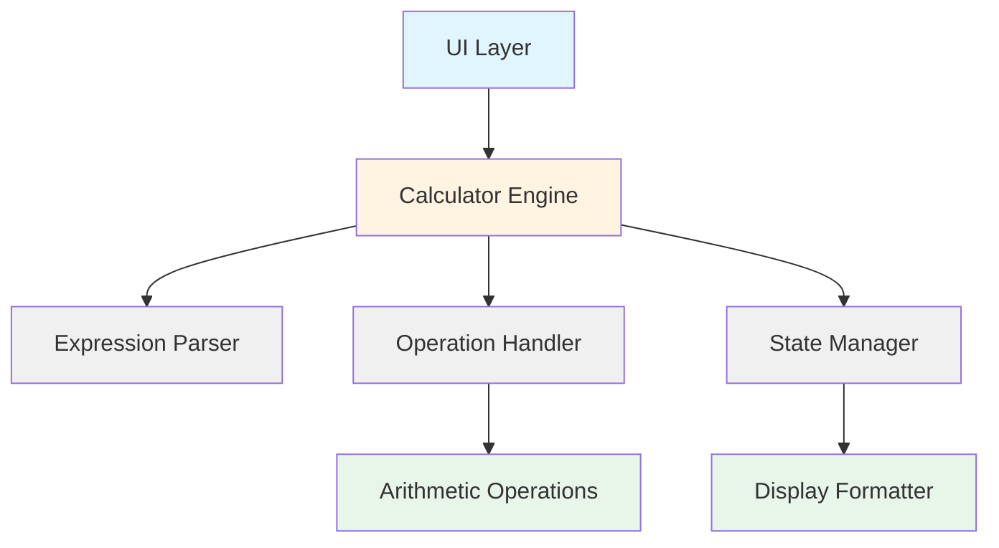
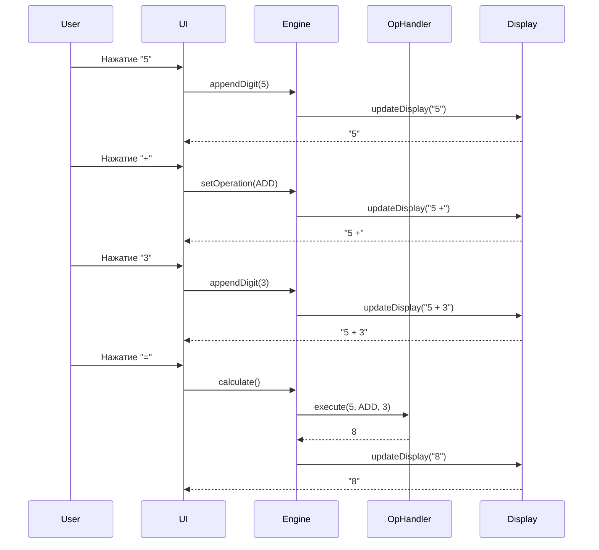
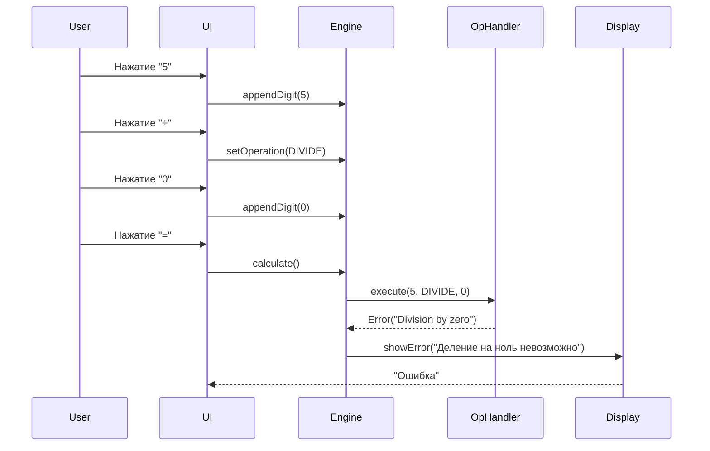

# Документ технического дизайна: Простой калькулятор

## Обзор

Простой калькулятор в стиле Windows Calculator предоставляет базовую функциональность для выполнения арифметических операций. Приложение включает стандартный интерфейс с цифровыми кнопками (0-9), операторами (+, -, ×, ÷), функциями очистки (C, CE), управлением знаком (+/-), десятичной точкой и кнопкой равно. Калькулятор поддерживает цепочечные вычисления, отображает текущее выражение и результат, обрабатывает ошибки (деление на ноль) и сохраняет историю последней операции для повторного использования.

## Архитектура

Калькулятор построен по модульной архитектуре с разделением ответственности между компонентами:



## Основные потоки взаимодействия

### Поток 1: Базовое вычисление



### Поток 2: Обработка ошибок



## Компоненты и интерфейсы

### Компонент 1: UI Layer (Слой пользовательского интерфейса)

**Назначение**: Отображение калькулятора и обработка пользовательского ввода

**Интерфейс**:
```typescript
interface CalculatorUI {
  renderDisplay(value: string, expression: string): void
  renderButtons(): void
  handleButtonClick(button: ButtonType): void
  showError(message: string): void
  clearError(): void
}

enum ButtonType {
  DIGIT_0, DIGIT_1, DIGIT_2, DIGIT_3, DIGIT_4,
  DIGIT_5, DIGIT_6, DIGIT_7, DIGIT_8, DIGIT_9,
  ADD, SUBTRACT, MULTIPLY, DIVIDE,
  EQUALS, CLEAR, CLEAR_ENTRY, DECIMAL,
  NEGATE, PERCENT
}
```

**Ответственность**:
- Отрисовка визуального интерфейса калькулятора
- Обработка кликов по кнопкам и клавиатурного ввода
- Отображение текущего значения и выражения
- Визуальная обратная связь (подсветка кнопок, анимации)

### Компонент 2: Calculator Engine (Вычислительный движок)

**Назначение**: Центральная логика управления состоянием и координация операций

**Интерфейс**:
```typescript
interface CalculatorEngine {
  appendDigit(digit: number): void
  appendDecimal(): void
  setOperation(op: Operation): void
  calculate(): CalculationResult
  clear(): void
  clearEntry(): void
  negate(): void
  percent(): void
  getState(): CalculatorState
}

enum Operation {
  ADD,
  SUBTRACT,
  MULTIPLY,
  DIVIDE
}

interface CalculationResult {
  success: boolean
  value?: number
  error?: string
}
```

**Ответственность**:
- Управление состоянием калькулятора
- Координация между компонентами
- Валидация операций
- Обработка последовательности операций

### Компонент 3: State Manager (Менеджер состояния)

**Назначение**: Хранение и управление текущим состоянием калькулятора

**Интерфейс**:
```typescript
interface StateManager {
  getCurrentValue(): number
  setCurrentValue(value: number): void
  getStoredValue(): number | null
  setStoredValue(value: number): void
  getPendingOperation(): Operation | null
  setPendingOperation(op: Operation | null): void
  getExpression(): string
  updateExpression(expr: string): void
  isNewInput(): boolean
  setNewInput(flag: boolean): void
  reset(): void
}

interface CalculatorState {
  currentValue: number
  storedValue: number | null
  pendingOperation: Operation | null
  expression: string
  isNewInput: boolean
  hasError: boolean
}
```

**Ответственность**:
- Хранение текущего значения на дисплее
- Хранение предыдущего значения для операций
- Отслеживание ожидающей операции
- Управление строкой выражения
- Флаги состояния (новый ввод, ошибка)

### Компонент 4: Operation Handler (Обработчик операций)

**Назначение**: Выполнение арифметических операций

**Интерфейс**:
```typescript
interface OperationHandler {
  execute(left: number, operation: Operation, right: number): CalculationResult
  add(a: number, b: number): number
  subtract(a: number, b: number): number
  multiply(a: number, b: number): number
  divide(a: number, b: number): CalculationResult
}
```

**Ответственность**:
- Выполнение арифметических операций
- Проверка на деление на ноль
- Обработка переполнения и точности чисел
- Возврат результатов или ошибок

### Компонент 5: Display Formatter (Форматировщик дисплея)

**Назначение**: Форматирование чисел для отображения

**Интерфейс**:
```typescript
interface DisplayFormatter {
  formatNumber(value: number): string
  formatExpression(left: number, op: Operation | null, right: number | null): string
  truncateIfNeeded(value: string, maxLength: number): string
}
```

**Ответственность**:
- Форматирование чисел с разделителями разрядов
- Ограничение количества десятичных знаков
- Обработка очень больших и очень малых чисел
- Форматирование строки выражения

## Модели данных

### Модель 1: CalculatorState

```typescript
interface CalculatorState {
  currentValue: number          // Текущее значение на дисплее
  storedValue: number | null    // Сохраненное значение для операции
  pendingOperation: Operation | null  // Ожидающая операция
  expression: string            // Строка выражения для отображения
  isNewInput: boolean          // Флаг начала нового ввода
  hasError: boolean            // Флаг наличия ошибки
}
```

**Правила валидации**:
- currentValue должно быть конечным числом
- storedValue может быть null или конечным числом
- pendingOperation может быть null или одной из четырех операций
- expression не должна превышать максимальную длину дисплея
- isNewInput и hasError являются булевыми значениями

**Инварианты состояния**:
- Если hasError === true, то pendingOperation === null
- Если isNewInput === true и pendingOperation !== null, то storedValue !== null
- expression всегда синхронизирована с текущим состоянием

### Модель 2: CalculationResult

```typescript
interface CalculationResult {
  success: boolean
  value?: number
  error?: string
}
```

**Правила валидации**:
- Если success === true, то value должно быть определено
- Если success === false, то error должно быть определено
- value и error не могут быть определены одновременно

### Модель 3: ButtonConfig

```typescript
interface ButtonConfig {
  type: ButtonType
  label: string
  gridPosition: GridPosition
  style: ButtonStyle
}

interface GridPosition {
  row: number
  column: number
  span?: number
}

enum ButtonStyle {
  DIGIT,      // Цифровые кнопки (0-9)
  OPERATOR,   // Операторы (+, -, ×, ÷)
  FUNCTION,   // Функциональные кнопки (C, CE, +/-)
  EQUALS      // Кнопка равно
}
```

**Правила валидации**:
- row и column должны быть положительными целыми числами
- span должен быть >= 1 если определен
- label не должен быть пустой строкой

## Обработка ошибок

### Сценарий ошибки 1: Деление на ноль

**Условие**: Пользователь пытается разделить число на ноль
**Реакция**: 
- Operation Handler возвращает CalculationResult с success: false и error: "Division by zero"
- Engine устанавливает hasError: true в состоянии
- Display показывает сообщение "Деление на ноль невозможно"
**Восстановление**: 
- Пользователь нажимает C (Clear) для сброса состояния
- Любая новая цифра автоматически очищает ошибку и начинает новый ввод

### Сценарий ошибки 2: Переполнение числа

**Условие**: Результат вычисления превышает максимальное представимое число
**Реакция**:
- Operation Handler проверяет результат на Infinity или -Infinity
- Возвращает CalculationResult с ошибкой "Overflow"
- Display показывает "Переполнение"
**Восстановление**:
- Аналогично сценарию деления на ноль
- Состояние сбрасывается при нажатии C или вводе новой цифры

### Сценарий ошибки 3: Недопустимый ввод

**Условие**: Попытка ввести вторую десятичную точку в число
**Реакция**:
- Engine проверяет текущее значение на наличие десятичной точки
- Игнорирует повторное нажатие кнопки десятичной точки
- Визуальная обратная связь (кратковременная подсветка)
**Восстановление**: Не требуется, операция просто игнорируется

## Стратегия тестирования

### Подход к модульному тестированию

**Operation Handler**:
- Тестирование всех четырех арифметических операций с положительными и отрицательными числами
- Тестирование граничных случаев (0, очень большие числа, очень малые числа)
- Тестирование деления на ноль
- Тестирование точности вычислений с десятичными числами

**State Manager**:
- Тестирование переходов состояний
- Тестирование сброса состояния
- Тестирование инвариантов состояния
- Тестирование синхронизации expression с состоянием

**Display Formatter**:
- Тестирование форматирования целых чисел
- Тестирование форматирования десятичных чисел
- Тестирование усечения длинных чисел
- Тестирование форматирования выражений

### Подход к тестированию на основе свойств

**Библиотека для тестирования свойств**: fast-check (для TypeScript/JavaScript) или hypothesis (для Python)

**Свойство 1: Коммутативность сложения и умножения**
- Для любых чисел a и b: a + b = b + a
- Для любых чисел a и b: a × b = b × a

**Свойство 2: Ассоциативность операций**
- Для любых чисел a, b, c: (a + b) + c = a + (b + c)
- Для любых чисел a, b, c: (a × b) × c = a × (b × c)

**Свойство 3: Идемпотентность очистки**
- После нажатия C состояние всегда сбрасывается к начальному
- Повторное нажатие C не изменяет состояние

**Свойство 4: Обратимость операций**
- Для любого числа a: (a + b) - b = a
- Для любого числа a и b ≠ 0: (a × b) ÷ b = a

### Подход к интеграционному тестированию

**Сценарий 1: Цепочечные вычисления**
- Тестирование последовательности операций: 5 + 3 - 2 × 4 ÷ 2
- Проверка правильности промежуточных результатов
- Проверка корректности отображения выражения

**Сценарий 2: Взаимодействие UI и Engine**
- Симуляция последовательности кликов пользователя
- Проверка синхронизации между UI и состоянием
- Проверка обновления дисплея после каждой операции

**Сценарий 3: Обработка ошибок end-to-end**
- Симуляция деления на ноль через UI
- Проверка отображения ошибки
- Проверка восстановления после ошибки

## Компоненты и интерфейсы

### Компонент 1: Calculator Engine

**Назначение**: Центральный координатор всех операций калькулятора

**Интерфейс**:
```typescript
interface CalculatorEngine {
  // Ввод цифр
  appendDigit(digit: number): void
  appendDecimal(): void
  
  // Операции
  setOperation(op: Operation): void
  calculate(): CalculationResult
  
  // Функции управления
  clear(): void              // C - полная очистка
  clearEntry(): void         // CE - очистка текущего ввода
  negate(): void            // +/- - изменение знака
  percent(): void           // % - процент
  
  // Получение состояния
  getState(): CalculatorState
  getDisplayValue(): string
  getExpression(): string
}
```

**Ответственность**:
- Координация между State Manager и Operation Handler
- Валидация пользовательского ввода
- Управление потоком вычислений
- Обработка специальных функций (%, +/-)

### Компонент 2: State Manager

**Назначение**: Управление состоянием калькулятора

**Интерфейс**:
```typescript
interface StateManager {
  // Управление значениями
  getCurrentValue(): number
  setCurrentValue(value: number): void
  getStoredValue(): number | null
  setStoredValue(value: number): void
  
  // Управление операциями
  getPendingOperation(): Operation | null
  setPendingOperation(op: Operation | null): void
  
  // Управление выражением
  getExpression(): string
  updateExpression(expr: string): void
  
  // Флаги состояния
  isNewInput(): boolean
  setNewInput(flag: boolean): void
  hasError(): boolean
  setError(flag: boolean): void
  
  // Сброс
  reset(): void
  resetEntry(): void
}
```

**Ответственность**:
- Хранение всех данных состояния
- Обеспечение инвариантов состояния
- Предоставление атомарных операций изменения состояния
- Изоляция состояния от других компонентов

### Компонент 3: Operation Handler

**Назначение**: Выполнение арифметических операций

**Интерфейс**:
```typescript
interface OperationHandler {
  execute(left: number, operation: Operation, right: number): CalculationResult
  
  // Базовые операции
  add(a: number, b: number): number
  subtract(a: number, b: number): number
  multiply(a: number, b: number): number
  divide(a: number, b: number): CalculationResult
  
  // Вспомогательные функции
  isValidNumber(value: number): boolean
  checkOverflow(value: number): boolean
}
```

**Ответственность**:
- Выполнение арифметических операций
- Проверка на деление на ноль
- Проверка на переполнение
- Обеспечение точности вычислений

### Компонент 4: Display Formatter

**Назначение**: Форматирование чисел и выражений для отображения

**Интерфейс**:
```typescript
interface DisplayFormatter {
  formatNumber(value: number, maxDigits?: number): string
  formatExpression(state: CalculatorState): string
  parseDisplayValue(display: string): number
  
  // Константы форматирования
  readonly MAX_DISPLAY_DIGITS: number
  readonly DECIMAL_PRECISION: number
}
```

**Ответственность**:
- Форматирование чисел с разделителями тысяч
- Ограничение количества отображаемых цифр
- Форматирование научной нотации для больших чисел
- Построение строки выражения

## Модели данных

### CalculatorState

```typescript
interface CalculatorState {
  currentValue: number          // Текущее отображаемое значение
  storedValue: number | null    // Сохраненное значение для операции
  pendingOperation: Operation | null  // Ожидающая операция
  expression: string            // "5 + 3" или "8"
  isNewInput: boolean          // true после операции или =
  hasError: boolean            // true при ошибке
}
```

**Правила валидации**:
- currentValue: должно быть конечным числом (не NaN, не Infinity)
- storedValue: null или конечное число
- pendingOperation: null или валидная операция из enum Operation
- expression: строка длиной <= MAX_DISPLAY_LENGTH
- isNewInput: булево значение
- hasError: булево значение

**Инварианты**:
- hasError === true ⟹ pendingOperation === null
- pendingOperation !== null ⟹ storedValue !== null
- isNewInput === true после нажатия операции или =

### Operation

```typescript
enum Operation {
  ADD = '+',
  SUBTRACT = '-',
  MULTIPLY = '×',
  DIVIDE = '÷'
}
```

### CalculationResult

```typescript
interface CalculationResult {
  success: boolean
  value?: number
  error?: string
}
```

**Правила валидации**:
- success === true ⟺ value !== undefined && error === undefined
- success === false ⟺ error !== undefined && value === undefined

## Свойства корректности

### Свойство 1: Арифметическая точность

```typescript
// Для всех допустимых чисел a, b и операции op:
∀ a, b ∈ ℝ, op ∈ {ADD, SUBTRACT, MULTIPLY, DIVIDE}:
  execute(a, op, b).success === true ⟹ 
    |execute(a, op, b).value - mathematicalResult(a, op, b)| < EPSILON
```

Где EPSILON - допустимая погрешность вычислений с плавающей точкой.

### Свойство 2: Обработка деления на ноль

```typescript
// Деление на ноль всегда возвращает ошибку:
∀ a ∈ ℝ:
  execute(a, DIVIDE, 0).success === false ∧
  execute(a, DIVIDE, 0).error === "Division by zero"
```

### Свойство 3: Идемпотентность очистки

```typescript
// Повторная очистка не изменяет состояние:
∀ state: CalculatorState:
  let state1 = clear(state)
  let state2 = clear(state1)
  state1 === state2
```

### Свойство 4: Коммутативность

```typescript
// Сложение и умножение коммутативны:
∀ a, b ∈ ℝ:
  execute(a, ADD, b).value === execute(b, ADD, a).value ∧
  execute(a, MULTIPLY, b).value === execute(b, MULTIPLY, a).value
```

### Свойство 5: Ассоциативность

```typescript
// Сложение и умножение ассоциативны:
∀ a, b, c ∈ ℝ:
  execute(execute(a, ADD, b).value, ADD, c).value === 
    execute(a, ADD, execute(b, ADD, c).value).value
```

### Свойство 6: Согласованность состояния

```typescript
// После любой операции состояние остается валидным:
∀ state: CalculatorState, operation: UserOperation:
  isValid(state) ⟹ isValid(applyOperation(state, operation))
```

### Свойство 7: Обратимость операций

```typescript
// Операции обратимы (в пределах точности):
∀ a, b ∈ ℝ:
  |execute(execute(a, ADD, b).value, SUBTRACT, b).value - a| < EPSILON ∧
  (b ≠ 0 ⟹ |execute(execute(a, MULTIPLY, b).value, DIVIDE, b).value - a| < EPSILON)
```

## Обработка ошибок

### Сценарий 1: Деление на ноль

**Условие**: execute(a, DIVIDE, 0) вызывается
**Реакция**: Возврат CalculationResult { success: false, error: "Division by zero" }
**Восстановление**: Пользователь нажимает C или начинает новый ввод

### Сценарий 2: Переполнение

**Условие**: Результат > Number.MAX_SAFE_INTEGER или < Number.MIN_SAFE_INTEGER
**Реакция**: Возврат CalculationResult { success: false, error: "Overflow" }
**Восстановление**: Пользователь нажимает C или начинает новый ввод

### Сценарий 3: Недопустимый формат числа

**Условие**: Попытка ввести вторую десятичную точку
**Реакция**: Игнорирование ввода, визуальная обратная связь
**Восстановление**: Не требуется, состояние не изменяется

## Рекомендации по производительности

**Оптимизация отрисовки UI**:
- Использовать виртуализацию для истории вычислений (если добавляется)
- Дебаунсинг обновлений дисплея при быстром вводе
- Минимизация перерисовок компонентов

**Управление состоянием**:
- Использовать иммутабельные обновления состояния
- Избегать глубокого копирования при каждом изменении
- Кэширование форматированных строк дисплея

**Вычисления**:
- Использовать нативные арифметические операции
- Избегать преобразований строка-число при каждом нажатии
- Оптимизация проверок валидации

## Соображения безопасности

**Валидация ввода**:
- Ограничение максимальной длины числа для предотвращения DoS
- Проверка на NaN и Infinity перед операциями
- Санитизация строковых представлений чисел

**Безопасность состояния**:
- Предотвращение инъекций через строку выражения
- Изоляция состояния калькулятора от глобального состояния
- Защита от race conditions при асинхронных операциях (если применимо)

**Безопасность памяти**:
- Ограничение размера истории операций
- Очистка чувствительных данных при сбросе
- Предотвращение утечек памяти в обработчиках событий

## Зависимости

**Обязательные зависимости**:
- Отсутствуют (можно реализовать на чистом JavaScript/TypeScript)

**Опциональные зависимости**:
- UI Framework: React, Vue, или Vanilla JS
- State Management: Redux, MobX, или встроенное состояние
- Testing: Jest, Vitest для модульных тестов
- Property Testing: fast-check для тестирования свойств
- Build Tools: Vite, Webpack, или Parcel

**Системные требования**:
- Современный браузер с поддержкой ES6+
- Поддержка CSS Grid для раскладки кнопок
- Поддержка событий клавиатуры для ввода с клавиатуры
